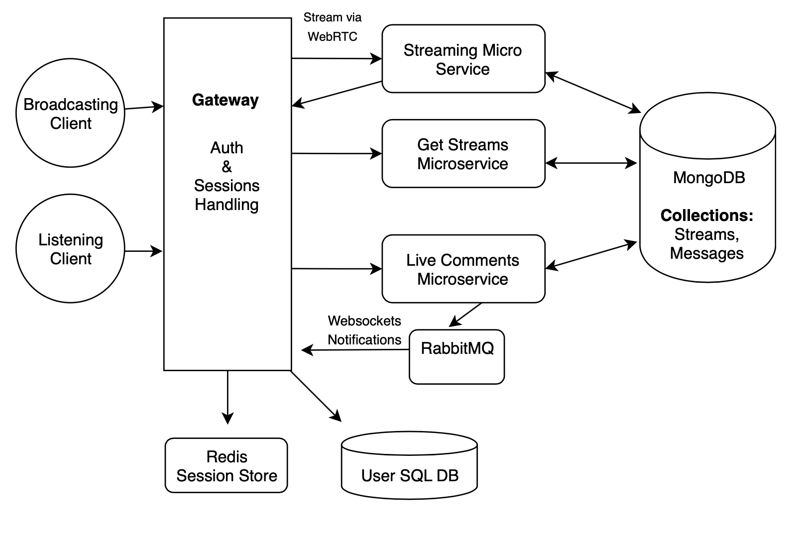

# Audio Streaming Service
# Project description

We will build a service that allows users to stream audio from a host to a server, which can then broadcast the stream to many users who tune in. The users will also have access to information about the stream, such as what song is being played, and be able to live chat about the stream. We have a 2 sided user base, streamers and listeners. The streamer users may have a broad variety of reasons to broadcast but they are essentially anyone who wants to broadcast an audio stream of any kind. This could take the form of a DJ mixing music, a typical radio show, or a podcast for example. The listeners are people who wish to listen to the content of the streamers, music fans, talk show fans, etc. Broadcasting is obviously a widely used technology, which is used by pretty much every person on earth with access to a computer, radio, or TV. There are plenty of people who listen to music and talk shows and plenty of people who wish to create broadcasted content as well. Our project will lower the barrier of entry for broadcasters, allowing them to broadcast with nothing more than a laptop. In turn, this will expose listeners to a wider variety of content. We want to build this app because it presents a challenging problem and interesting solution. We as a group are interested in music and want to learn how to build systems that facilitate the sharing of music.

#System Architecture


#Use Cases


#Handlers
Channels
/channels
POST
Creates a channel with the currently logged in user as the creator and as its first follower. Will require a JSON of:

```JSON
{
displayName: string,
description: string,
genre: string, 
creator: user,
createdAt: Date,
editedAt: Date,
goLiveTime: Date,
active: bool,
followers: [int(UserID)]
}
```
/channels/{channelID}
GET 
Will return a JSON of the requested channel and ideally bring them to the channel page (active or not).
```JSON
{
	_id: string
displayName: string,
description: string,
genre: string, 
creator: user,
createdAt: Date,
editedAt: Date,
goLiveTime: Date,
active: bool,
followers: [int(UserID)]
}
```

UPDATE 
Will update the specified channel to include the logged in user’s ID in the followers array. Will return the updated channel object.
```JSON
{
	_id: string
displayName: string,
description: string,
genre: string, 
creator: user,
createdAt: Date,
editedAt: Date,
goLiveTime: Date,
active: bool,
followers: [int(UserID)]
}
```
/channels/{userID}
GET
Will return an array of channel objects of which the specified userID is the creator.
```JSON
	[
{
_id: string
displayName: string,
description: string,
genre: string, 
creator: user,
createdAt: Date,
editedAt: Date,
goLiveTime: Date,
active: bool,
followers: [int(UserID)]
}
		]
		```

/users/{userID}/following
GET
This handler will return an array of channels of which the specified userID is a follower of.
```JSON
[
		{
_id: string,
displayName: string,
description: string,
genre: string,
creator: user,
createdAt: Date,
editedAt: Date,
goLiveTime: Date,
active: bool,
followers: [int(UserID)]
}
]
```
/channels/live?genre={string}
GET
Will return the newest 10 active channels. Optional genre parameter
```JSON
	[
		{
_id: string,
displayName: string,
description: string,
genre: string,
creator: user,
createdAt: Date,
editedAt: Date,
goLiveTime: Date,
active: bool,
followers: [int(UserID)]
}
]
```
/channels/all?genre={string}
GET
Will return the newest 10 channels with no regard to active status. Optional genre parameter
```JSON
	[
		{
_id: string,
displayName: string,
description: string,
genre: string,
creator: user,
createdAt: Date,
editedAt: Date,
goLiveTime: Date,
active: bool,
followers: [int(UserID)]
}
]
/channels/{channelID}/start
PATCH
Will update the specified channel to set it’s active status to true, as well as begin streaming from the logged in client ONLY if the logged in user is the creator of the specified channel. Returns the updated channel.
```

```JSON
{
	_id: string
displayName: string,
description: string,
genre: string, 
creator: user,
createdAt: Date,
editedAt: Date,
goLiveTime: Date,
active: TRUE,
followers: [int(UserID)]
}
```
/channels/{channelID}/stop
PATCH
Will update the specified channel to set it’s active status to false, as well as end streaming from the logged in client ONLY if the logged in user is the creator of the specified channel. Returns the updated channel.
```JSON
{
	_id: string
displayName: string,
description: string,
genre: string, 
creator: user,
createdAt: Date,
editedAt: Date,
goLiveTime: Date,
active: TRUE,
followers: [int(UserID)]
}
```
Comments
/comments/{channelID}
GET 
This will retrieve the last 30 comments from a specified channel and return an array of the comments.
```JSON
[
{
_id: string,
body: string,
creator: user,
createdAt: Date,
editedAt: Date,
channelID: string
}

]
```

POST
Post will allow the logged in user to post a comment to a channel by sending the following JSON.

```JSON
{
body: string,
creator: user,
createdAt: Date,
editedAt: Date,
channelID: string
}
/comments/{commentID}
```
PATCH
This will allow the user to edit the specified comment that they are the creator of.
```JSON
		{
			commentID: string,
			body: string
		}
```

DELETE
This will allow the user to delete the specified message that they are the creator of.

Users
/users
POST
This will serve as the user creation handler and will require a JSON as follows
```JSON
{
email: string,
password: string,
passwordConf: string,
userName: string,
firstName: string,
lastName: string
}
```

/users/{userName}
GET 
This will fetch the user details of a specified username and be used to display a user’s profile page and their channels
```JSON
{
ID: int,
userName: string,
firstName: string,
lastName: string,
createdAt: Date,
editedAt: Date,
photoURL: string,

}
```

Sessions
/sessions
POST 
This handler will accept login credentials in the form of JSON, then perform authentication and begin a new session for the user if successful
```JSON
{
email: string,
password: string
}
```
DELETE
This handler will be used to log out the currently authenticated user
/sessions/{sessionID}
GET
This handler will fetch the state of a specified sessionID and then return that sessionState object. This will be used to verify that a user is logged in or authenticated.
```JSON
{
sessionBegin: Time,
user: User,
}.
```

