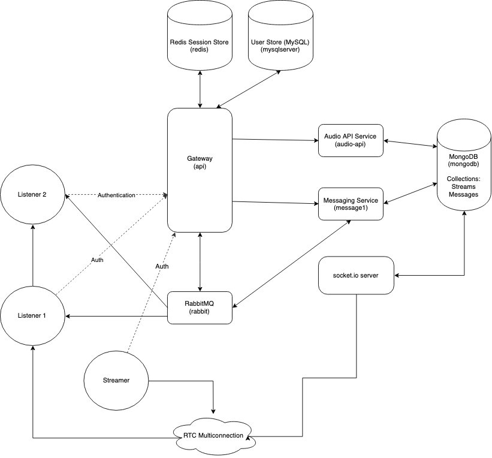
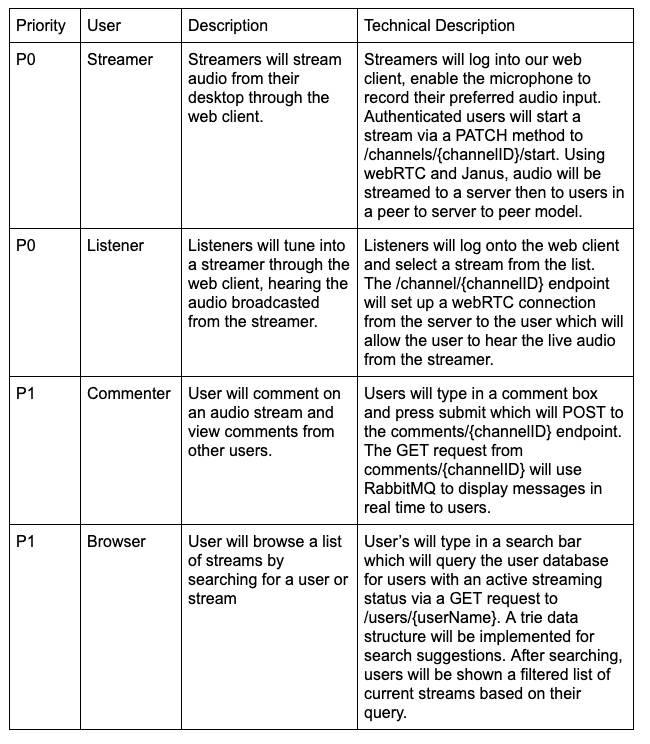

# Audio Streaming Service
# Project description

link to service https://audio-api.kjgoodwin.me/v1/

link to ios client https://github.com/Escohen98/Radiu

We will build a service that allows users to stream audio from a host to a server, which can then broadcast the stream to many users who tune in. The users will also have access to information about the stream, such as what song is being played, and be able to live chat about the stream. We have a 2 sided user base, streamers and listeners. The streamer users may have a broad variety of reasons to broadcast but they are essentially anyone who wants to broadcast an audio stream of any kind. This could take the form of a DJ mixing music, a typical radio show, or a podcast for example. The listeners are people who wish to listen to the content of the streamers, music fans, talk show fans, etc. Broadcasting is obviously a widely used technology, which is used by pretty much every person on earth with access to a computer, radio, or TV. There are plenty of people who listen to music and talk shows and plenty of people who wish to create broadcasted content as well. Our project will lower the barrier of entry for broadcasters, allowing them to broadcast with nothing more than a laptop. In turn, this will expose listeners to a wider variety of content. We want to build this app because it presents a challenging problem and interesting solution. We as a group are interested in music and want to learn how to build systems that facilitate the sharing of music.

___________________________________
# System Architecture

___________________________________

# Use Cases


___________________________________
# Endpoints
## Channels
### /channels
#### POST
Creates a channel with the currently logged in user as the `creator`. Will require a JSON of:

```JS
{
	"channelID": String,
	"displayName": String,
	"description": String,
	"genre": String
}
```
#### GET
Will return a an array of JSON objects which are the requested channels can accept query parameters such as `?live=true`, `?genre=rock` and `?username=johndoe`.
```JS
[
	{
		"_id": String
		"channelID": String,
		"displayName": String,
		"description": String,
		"genre": String,
		"creator": User,
		"createdAt": Date,
		"goLiveTime": Date,
		"active": bool,
		"activeListeners": [int],
		"followers": [int]
	}
]
```


### /channels/{channelID}
#### GET
Will return a JSON of the requested channel and ideally bring them to the channel page (active or not).
```JS
{
	"_id": String
	"channelID": String,
	"displayName": String,
	"description": String,
	"genre": String,
	"creator": User,
	"createdAt": Date,
	"goLiveTime": Date,
	"active": bool,
	"activeListeners": [int],
	"followers": [int]
}

```

#### PATCH
Will first verify that the sender is the `creator` of the `channel` then update the specified `channel` with the updated `genre`, `displayName`, `description` or all three.
```JS
{
	"displayName": String,
	"description": String,
	"genre": String
}
```

### /status/{channelID}
#### POST
Can handle updates to the "currently playing" song. 

```JS
{
	"text": String,
	"photoURL": String
}
```
### /channels/{channelID}/followers
#### POST
Will add the currently authenticated `user` to the `listeners` array of the specified `channelID`.

#### DELETE
Will remove the currently authenticated `user` from the `followers` array of the specified `channelID`.


### /channels/{channelID}/listeners
#### POST
Will add the currently authenticated `user` to the `followers` array of the specified `channelID`.

#### DELETE
Will remove the currently authenticated `user` from the `listeners` array of the specified `channelID`. If you are a listener of a `channel`, you will receive notifications (rabbit messages) for messages to the `channel`.


## Comments
### /comments/{channelID}
#### GET
This will retrieve the last 100 `comments` from a specified `channel` and return an array of the `comments`.
```JS
[
	{
		"_id": String,
		"body": String,
		"creator": user,
		"createdAt": Date,
		"editedAt": Date,
		"channelID": String
	}
]
```

#### POST
Post will allow the logged in `user` to post a `comment` to a `channel` by sending the following JSON.

```JS
{
	"body": String,
	"creator": user,
	"createdAt": Date,
	"editedAt": Date,
	"channelID": String
}

```
### /comments/{commentID}
#### PATCH
This will allow the `user` to edit the specified `comment` that they are the `creator` of.
```JS
		{
			"commentID": String,
			"body": String
		}
```

#### DELETE
This will allow the user to delete the specified `comment` that they are the `creator` of.

## Users
### /users
#### POST
This will serve as the `user` creation handler and will require a JSON as follows
```JS
{
	"email": String,
	"password": String,
	"passwordConf": String,
	"userName": String,
	"firstName": String,
	"lastName": String
}
```

### /users/{userName}
#### GET
This will fetch the `user` details of a specified `userName` and be used to display a user’s profile page and their channels
```JS
{
	"ID": int,
	"userName": String,
	"firstName": String,
	"lastName": String,
	"createdAt": Date,
	"editedAt": Date,
	"photoURL": String,
}
```

## Sessions
### /sessions
#### POST
This handler will accept login `credentials` in the form of JSON, then perform authentication and begin a new `session` for the user if successful
```JS
{
	"email": String,
	"password": String
}
```
#### DELETE
This handler will be used to log out the currently authenticated `user`

### /sessions/{sessionID}
#### GET
This handler will fetch the state of a specified `sessionID` and then return that `sessionState` object. This will be used to verify that a `user` is logged in or authenticated.
```JS
{
	"sessionBegin": Time,
	"user": User
}
```

# Database Schemas
## MySQL
```SQL
create table if not exists users (
    id int not null auto_increment primary key,
    email varchar(255) not null,
    password_hash binary(60) not null,
    username varchar(255) not null,
    first_name varchar(64),
    last_name varchar(64),
    photo_url varchar(255) not null,
    index email_index (email),
    index username_index (username)
);

CREATE UNIQUE INDEX index_unique ON users(email);
CREATE UNIQUE INDEX index_unique_username ON users(username);


create table if not exists logins (
    login_key int not null auto_increment primary key,
    user_id int not null,
    login_time datetime not null,
    user_ip varchar(39) not null
);
```

## MongoDB (Mongoose) Schemas

```JS
let streamSchema = new Schema({
    channelID: {type: String, required: true, unique: true},
    displayName: {type: String, required: true},
    discription: {type: String, required: false},
    genre: {type: String, required: true},
    createdAt: {type: Date, required: true, default: Date.now},
    goLiveTime: {type: Date, required: false},
    creator:{ type: {
        id: Number,
        userName: String,
        firstName: String,
        lastName: String,
        photoURL: String
    }, required: true} ,
    active: {type: Boolean, required: true},
    activeListeners: {type: [Number], required: true},
    followers: {type: [Number], required: true}
});

let messageSchema = new Schema({
    channelID: {type: String, required: true},
    body: {type: String, required: true},
    createdAt: {type: Date, required: true, default: Date.now},
    creator: {
        id: Number,
        userName: String,
        firstName: String,
        lastName: String,
        photoURL: String
    },
    editedAt: {type: Date}
});
```
